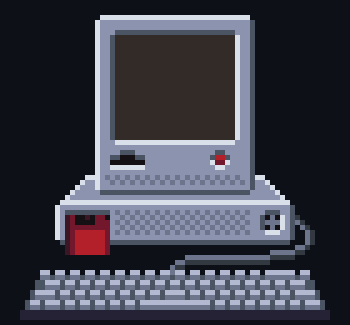

<h6 align="center" >Pixel-Art Animation by Donald Gjoka</h6>

<picture>
  <source media="(prefers-color-scheme: dark)" srcset="Assets/GitHubMonitor(500).webp">
  <source media="(prefers-color-scheme: light)" srcset="Assets/LightModeGitHubMonitor(500).webp">
  
</picture>

<h1 align="center" >👋 Hi, I’m <a href="https://donaldgjoka.github.io/">@DonaldGjoka</a> </h1>
<h3 align="center" >📓 What I'm doing! 🖥️</h3>

<!--- Horrible mix of markdown and HTML lol | Will redo at some point later. --->
> <ul >
>  <li> 🏫 Working on a Computer-Science Degree</li>
>  <li> 👨‍💻 Currently furthering my programming skills</li>
>  <li>🌱 Learning OOP with C++ </li>
>  <li>💻 Hoping to slowly populate this git with neat things I've made</li>
>  <li>🌩 Tackling the Web Development Foundations Course on <a href="https://www.TheOdinProject.com/">The Odin Project!</a>! </li>
> </ul>

 

<h3 align="center">📷 Hobbies! 🎨</h3>

> <ul > 
> <li> 📷 Photography: You can see my work on my <a href="https://www.instagram.com/dongjoka/">Instagram</a>! I shoot with a Canon 5D Mark II and drone (Mavic Mini 2/ Mavic Zoom). I am Part-107 Certified! Currently, I don't post often due to focusing on my studies but I will resume after I am done.</li>
> <li>🕹️ Video Games 👾</li>
> <li> ✏️ Creating Pixel Art 🎨</li>
> <li> 🎨 Drawing & Painting 🖌️</li>
> </ul>

<!---

DonaldGjoka/DonaldGjoka is a ✨ special ✨ repository because its `README.md` (this file) appears on your GitHub profile.
You can click the Preview link to take a look at your changes.

https://rahuldkjain.github.io/gh-profile-readme-generator/

Visitor Counter Code:

{}

--->

